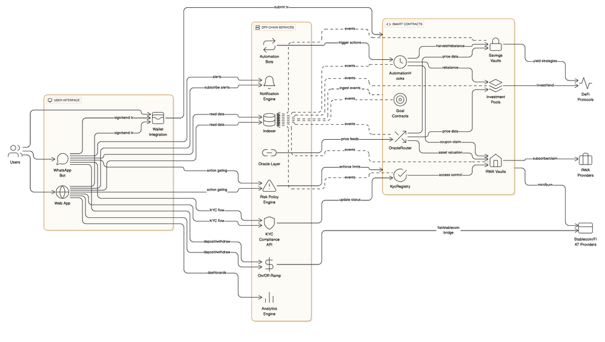

# CryptoVest: Blockchain-Powered Savings & Investment Platform

## 1. Problem Statement

Millions of people around the world earn income in crypto (freelancers, remote workers, traders, DeFi users). However, they face **three major problems**:

1. **Lack of structured savings tools in crypto** – While users can hold tokens in wallets, there are limited ways to automate savings, set financial goals, or earn structured returns similar to traditional “piggy banks” or savings plans.

2. **Limited access to safe investments** – Most investment opportunities are either centralized (custodial exchanges, prone to hacks/insolvency) or highly technical (staking, yield farming), making them inaccessible to non-experts.

3. **Volatility & liquidity challenges** – Users want their savings protected from high volatility and prefer flexible liquidity (e.g., being able to withdraw when needed without high penalties).

Traditional fintech apps like Piggyvest solve this for fiat, but there’s no robust, decentralized alternative for crypto earners.

## 2. Proposed Blockchain Solution

**CryptoVest** will be a decentralized savings and investment platform built for crypto users. It allows individuals to:

- **Save**: Automate savings in stablecoins (e.g., USDC, DAI) through recurring deposits, goal-based vaults, and lock-up options.

- **Invest**: Provide access to tokenized real-world assets (e.g., treasury bills, bonds, real estate shares) and blockchain-native yield strategies (staking, lending pools).

- **Protect**: Offer risk-hedging options like auto-conversion to stablecoins or diversified savings pools.

Why Blockchain?

- **Transparency**: Smart contracts ensure funds are not mismanaged (unlike centralized custodians).

- **Security**: Non-custodial savings vaults reduce risks of fraud or insolvency.

- **Accessibility**: Anyone with a wallet can participate, without requiring bank accounts.

- **Programmability**: Automated goal tracking, recurring deposits, and yield distribution can run seamlessly on-chain.

### Choice of Blockchain Platform

- **Ethereum (Layer 2 – e.g., Arbitrum/Optimism)** for security and DeFi ecosystem access.

  - Pros: Mature ecosystem, stablecoin liquidity, DeFi integrations.

  - Cons: Mainnet gas fees high, hence Layer 2 for scalability.

- Alternative: **Base, Polygon** for lower fees and user-friendliness, if targeting emerging markets.

## 3. Architecture Overview

### Key Components

1. Smart Contracts

  - Savings Vaults: Users deposit stablecoins, set lock periods, earn yield.

  - Investment Pools: Tokenized access to DeFi/lending protocols or real-world assets.

  - Goal Contracts: Track user savings goals (e.g., “save 1 ETH for 12 months”).

2. Off-Chain Services

  - Oracle Layer: Price feeds (via Chainlink) to manage conversions & valuations.

  - KYC/Compliance API: For users investing in tokenized real-world assets.

  - Notification Engine: Reminders & alerts for deposits, goal progress, maturity dates.

3. User Interface

  - Web App/Whatsapp: Friendly dashboard to create savings plans, monitor investments, withdraw funds.

  - Wallet Integration: MetaMask, Coinbase Wallet, or native wallet for seamless deposits/withdrawals.

4. APIs & External Integrations

  - Stablecoin On/Off Ramps: Integration with fiat providers for deposits/withdrawals.

  - DeFi Protocol APIs: Lending protocols (Aave, Compound), staking services, and RWAs (Real-World Asset token providers).

### High-Level Architecture Diagram

